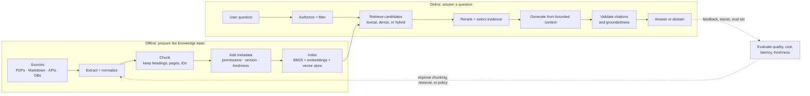

# What is Retrieval-Augmented Generation?

Retrieval-Augmented Generation (RAG) is a pattern where an application searches an external knowledge source at runtime and gives the selected evidence to a language model as context for its answer. The model is not retrained for each document update; the application changes the evidence it supplies.

The name comes from Lewis et al.'s 2020 paper, [*Retrieval-Augmented Generation for Knowledge-Intensive NLP Tasks*](https://arxiv.org/abs/2005.11401). The paper combines a pretrained sequence-to-sequence generator with a dense retriever over Wikipedia. It distinguishes the model's learned, **parametric** knowledge from retrieved, **non-parametric** memory.

## Why use it?

RAG is useful when an answer should be based on information that is:

- private or organization-specific;
- recent or frequently changing;
- too long to include in every prompt; or
- auditable with links, pages, sections, or records.

It does not automatically make a system factual. A RAG system can retrieve the wrong text, omit the relevant passage, misread a table, or generate a claim that the evidence does not support. Retrieval and generation must be designed and evaluated as separate components.

## The lifecycle

The lifecycle has two connected loops: an offline indexing loop that prepares
evidence, and an online question loop that selects and uses that evidence. The
same source identifiers and metadata should survive both loops so every answer
can be traced back to the material that supported it.

The diagram is intentionally not a single “embed and prompt” arrow. In a
production system, authorization happens before retrieved text enters the
context, and evaluation feeds improvements back into ingestion and retrieval.

1. **Ingest.** Extract text and structure from documents, databases, APIs, or files. Keep immutable source identifiers, permissions, timestamps, and locations (such as page and heading).
2. **Chunk.** Split content into units that can stand on their own. A good chunk contains enough local context to answer a question, while remaining specific enough to retrieve.
3. **Index.** Represent chunks for search. Dense embeddings support semantic similarity; lexical indexes such as BM25 preserve exact words, product codes, and names.
4. **Retrieve.** Turn a question into one or more searches. The system may filter by tenant, time, document type, or user authorization before selecting candidates.
5. **Rerank.** Apply a more accurate, usually more expensive, relevance model to a small candidate set.
6. **Generate.** Give the model a bounded context and instructions to answer from it, cite it, and abstain when evidence is insufficient.
7. **Evaluate.** Measure both whether the evidence was found and whether the response is supported by it.

### What happens at query time?

At query time, the application should preserve the user’s identity and request
constraints while it searches. A useful implementation separates these
responsibilities:

- **Policy layer:** determines which tenants, documents, fields, and tools the
  caller may access.
- **Retriever:** returns a broad candidate set and its scores, filters, and
  source IDs.
- **Ranker/context builder:** removes duplicates, applies a context budget, and
  preserves provenance next to each passage.
- **Generator:** answers only from the supplied evidence, says when evidence is
  missing, and emits citations that point to retrieved sources.
- **Evaluator/observer:** records retrieval misses, unsupported claims,
  latency, cost, and freshness without logging unnecessary sensitive content.

This separation makes failures diagnosable: an incorrect answer may be a
retrieval miss, an authorization bug, a context-selection problem, or a
generation/verification failure—not simply a “bad prompt.”

## RAG versus adjacent approaches

| Approach | Changes model weights? | Uses current external data? | Best for |
| --- | --- | --- |
| Prompting | No | Only what fits in prompt | Small, static context |
| RAG | No | Yes, at runtime | Grounded answers over evolving knowledge |
| Fine-tuning | Yes | Not by itself | Style, behavior, repeated task format |
| Tool use / SQL | No | Yes, by calling a system | Precise actions and structured, live facts |

These approaches combine well. For example, a support assistant might use RAG for policy text, SQL for account status, and fine-tuning for response style.

## Common misconceptions

### “A vector database is RAG”

A vector store is one implementation of one stage: candidate retrieval. RAG also includes extraction, chunking, permission enforcement, query handling, answer generation, citations, and evaluation. For many corpora, lexical or hybrid retrieval is essential.

### “More context is always better”

Extra context can dilute relevant evidence, increase cost and latency, and make it harder for a model to identify the right passage. Retrieve a small, high-quality set and test the chosen context budget.

### “Embeddings solve retrieval”

Embeddings capture semantic similarity but can underperform on exact names, error codes, rare entities, dates, and identifiers. Hybrid retrieval combines dense and lexical signals; reranking refines the final ordering.

## Further reading

- [Original RAG paper](https://arxiv.org/abs/2005.11401) — origin of the term and probabilistic formulation.
- [Dense Passage Retrieval](https://arxiv.org/abs/2004.04906) — foundation for many dense retrievers.
- [Stanford Introduction to Information Retrieval](https://nlp.stanford.edu/IR-book/) — lexical search, ranking, and retrieval evaluation.
- [LangChain retrieval documentation](https://docs.langchain.com/oss/python/langchain/retrieval) — current implementation-oriented overview.
